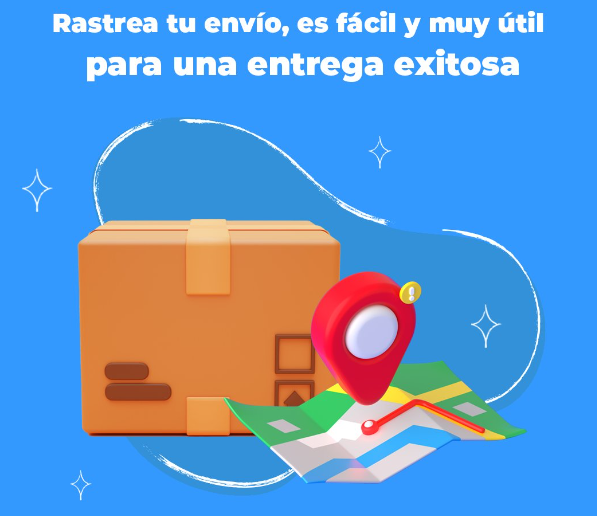

## About Project

Hello! Our project intends to implement a very useful application to facilitate the delivery of packages by transport companies.
In turn, provide a detailed user experience, about the process in which the package is, for the recipient of it.
Below you will find more specific information about the code implemented in this case, the frontend part, with React.



### Project Deployment

The server side from this project is deployed using fly.dev **[here](https://fly.io/apps/trackmateserver)**

The client side from this project is deployed using netlify **[here](https://trackmateclient.netlify.app)**

### Work structure

We have developed this project using **[Trello](https://trello.com/b/ySq7J01o/proyecto-3)** to organize our workflow.

### Installation guide

Fork and clone this repo and follow the belo instructions

```
    npm install
    npm start
```

### User Roles

| Role             | Capabilities                                                                                                                                                                                                                      | Properities          |
| :--------------- | :-------------------------------------------------------------------------------------------------------------------------------------------------------------------------------------------------------------------------------- | -------------------- |
| **User/User**    | User can `login/logout` to his/her personal profile and read/delete/create new packages, modify his/her personal data and one time package is send, can track the status of his sending looking the real position of the driver | isTransporter: false |
| **User/Carrier** | Driver have access to `login/logout` and to all packages, stored by sending day, and a map with the most optimal route to deliver his/her cargo                                                                                  | isTransporter: true  |

### User Routes
| Method     | Endpoint              | Description                                            |
| :--------- | :-------------------- | :----------------------------------------------------- |
| **POST**   | `/auth/login`         | User login                                             |
| **POST**   | `/auth/signup`        | User sign up information in database                   |
| **GET**    | `/auth/verify`        | Verify user inserted information with registred user in Database |
| **POST**   | `/user/avatar/${idUser}`       |  Update the avatar for user in Database                             |
| **GET**    | `/user/avatar/${idUser}`       | Retrieve the avatar from user in Database                           |


### Package routes

| Method     | Endpoint              | Description                                            |
| :--------- | :-------------------- | :----------------------------------------------------- |
| **GET**    | `/package/all` | Receive all the packages            |
| **GET**    | `/package/${idPackage}` | Get a package by id                 |
| **POST** | `/package/new` | Create a new package                |
| **PUT** | `/package/${packageId}/edit` | Edit the package by id                |
| **DELETE** | `/package/delete/${packageId}` | Delete package by id                |

